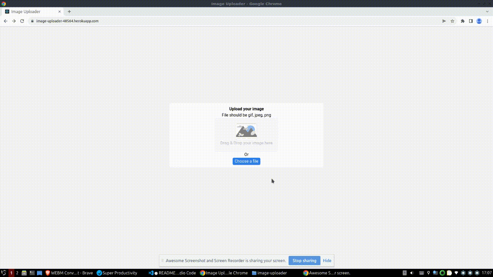
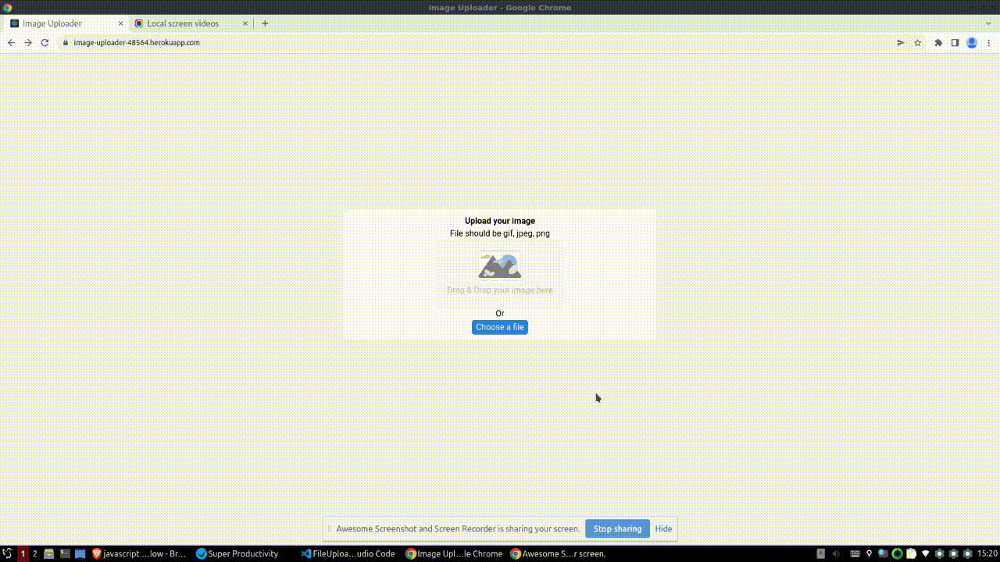

<h1 align="center">Image Uploader</h1>

<div align="center">
   Solution for a challenge from  <a href="http://devchallenges.io" target="_blank">Devchallenges.io</a>.
</div>

<div align="center">
  <h3>
    <a href="https://image-uploader-48564.herokuapp.com/">
      Solution
    </a>
    <span> | </span>
    <a href="https://devchallenges.io/challenges/O2iGT9yBd6xZBrOcVirx">
      Challenge
    </a>
  </h3>
</div>

## Overview

Visit [https://image-uploader-48564.herokuapp.com/](https://image-uploader-48564.herokuapp.com/).

Uploading an image:



Rate limiting:



### Built With

- React
- Express

## Features

The backend is secured with Helmet, `express-rate-limit` and `express-slow-down`. This way, the amount of images that can be uploaded, and the upload rate is limited, to prevent DoS attacks. Also, the files that can be uploaded are filtered to images of under 4MB.

This application/site was created as a submission to a [DevChallenges](https://devchallenges.io/challenges) challenge. The [challenge](https://devchallenges.io/challenges/O2iGT9yBd6xZBrOcVirx) was to build an application to complete the given user stories.

## Deploy

Since this is one project out of several others in the same repository, for pushing changes related to it run

```bash
# Only push the changes in the `backend/` folder
git subtree push --prefix image-uploader/backend heroku master
```

For running a complete deployment process (frontend building and pushing to Heroku), go to the `backend/` directory and run `npm run deploy`.
